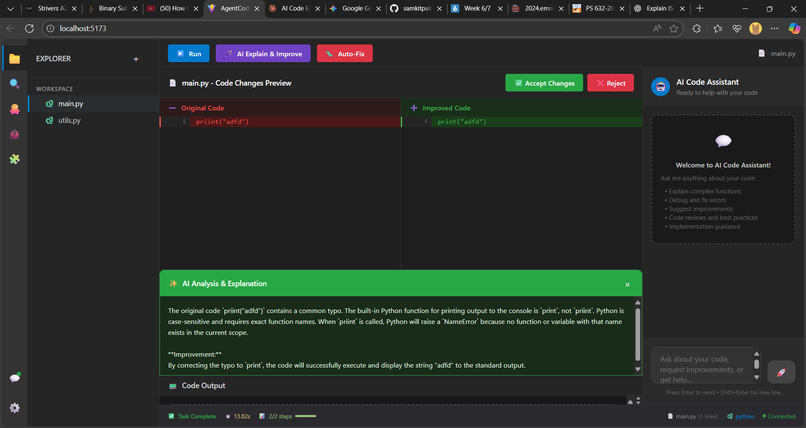

# AgentCodeV3

AgentCodeV3 is an experimental, agent-powered browser Python IDE with AI assistance. It integrates a frontend for interactive Python coding with a backend for code triage, planning, and AI-driven code improvement, powered by LLMs.

---

## Deep Project Structure & File-by-File Purpose

**Note: This is based on a code search limited to 10 results. More files and internal logic may exist. [View the full repo for all files.](https://github.com/samkitpalrecha/AgentCodeV3)**

---

### Root
- **README.md**: This file.
- **.gitignore**: Specifies intentionally untracked files to ignore.
- (Potential additional files not listed here.)

---

### backend/
#### Purpose: Python backend for agentic code triage, planning, and improvement.

- **main.py**  
  Placeholder/test script. Currently just prints "dgfh".  
  _Purpose: likely a stub or used for backend test runs._
- **state.py**  
  Defines the _core agent state and workflow data models_.  
  - `PlanStep`: Individual step in agent's improvement plan; tracks action, reasoning, dependencies, status, tools used, and timestamps.
  - `ExecutionMetrics`: Tracks backend agent performance (timing, search count, LLM calls, etc).
  - `AgentState`: The main class for tracking an entire agentic workflow, including user instruction, code, agent route, complexity, plan steps, logs, feedback, working memory, and results.  
  - `StepStatus`, `NodeType`: Enums for workflow node types/status.
  _Purpose: All agent workflow logic and state for step-by-step code improvement flows._
- **triage.py**  
  Implements the _TriageAgent_:
  - Classifies each user request to determine the right agent workflow and estimate complexity.
  - Uses Gemini LLM for analysis (model: `gemini-2.5-flash`).
  - Returns route (e.g., `simple_inquiry`, `simple_modification`, `complex_modification`, etc) and complexity score.
  _Purpose: Frontline classifier to optimize and branch the agent workflow._
- (Other backend files likely exist for API server, planner, developer, etc. See [repo](https://github.com/samkitpalrecha/AgentCodeV3) for more.)

---

### frontend/
#### Purpose: React-based web IDE for multi-file Python editing, execution, and agent-assisted improvement.

- **index.html**  
  Loads the React app, injects Pyodide (Python-to-WASM runtime), and defines the root div for mounting the UI.  
  _Purpose: Browser entry point; enables in-browser Python._
- **vite.config.js**  
  Frontend dev/build config (Vite).  
  - Proxies `/api` requests to the backend (assumes FastAPI on :8000).
- **src/main.jsx**  
  Entrypoint for React app.
  - Imports global styles, mounts `<App />` into `#root`.
- **src/App.jsx**  
  Main React component.  
  - Manages state: open files, active file/view, output, loading/streaming status, agent progress.
  - Integrates:
    - `CodeEditor`, `Toolbar`, `AgentPanel`, `OutputPane`, `ActivityBar`, `FileExplorer` (in `/components`)
    - `runPython` (Pyodide runner utility)
    - `callAgent`, `streamAgentExecution` (API utilities for backend agent)
  - Handles user actions: running code, launching agent, updating files, streaming agent UI.
  _Purpose: Orchestrates all frontend logic and agent interaction._
- **src/components/Toolbar.jsx**  
  Toolbar UI:  
  - "Run" button (executes code via Pyodide)
  - "Debug" and "Test" buttons (present, currently disabled)
  _Purpose: Fast access to core code actions._
- **src/App.css, src/index.css**  
  Application styles.  
  - Layout, theming, buttons, responsiveness, color modes.
  _Purpose: Consistent, modern UI/UX._
- (Other `/src/components/` files exist: `CodeEditor`, `AgentPanel`, `OutputPane`, `ActivityBar`, `FileExplorer`—see the repo for details.)

---

## Typical File Hierarchy (Partial)

```
AgentCodeV3/
├── backend/
│   ├── main.py
│   ├── state.py
│   ├── triage.py
│   └── (other agent/LLM/server/planner files)
├── frontend/
│   ├── index.html
│   ├── vite.config.js
│   └── src/
│        ├── main.jsx
│        ├── App.jsx
│        ├── App.css
│        ├── index.css
│        └── components/
│             ├── Toolbar.jsx
│             └── (CodeEditor.jsx, AgentPanel.jsx, ...)
├── README.md
└── .gitignore
```

---

## Backend: Agent Architecture (Based on Code)

- **AgentState** tracks the whole agentic process: from user instruction, through triage, step planning, execution, and result collation.
- **TriageAgent** runs first, selecting the optimal workflow branch and estimating complexity.
- **PlanStep** objects represent each atomic code change, refactor, or analysis the agent makes.
- **ExecutionMetrics** and logs allow for debugging and performance analysis.
- **LLM Integration** (Gemini) is used for route selection and likely also for code generation/planning in other modules.

---

## Frontend: IDE Architecture

- **Multi-file support**: Open, edit, and switch between several Python files.
- **Immediate run**: Code executes in-browser (WASM, no backend required for code execution).
- **Agent streaming**: Agent improvements are streamed stepwise to the frontend, showing progress and output in real time.
- **Componentized UI**: Clear separation for editor, output, files, toolbar, and agent interactions.

---



---

## Limitations

- Only the first 10 files/folders are indexed here. See [full repo](https://github.com/samkitpalrecha/AgentCodeV3) for all files, including likely additional backend logic (API endpoints, planner, developer, validator, etc.).
- This README is as semantically deep and accurate as possible given public code context.

---

For complete structure and code, [browse the full repository](https://github.com/samkitpalrecha/AgentCodeV3).